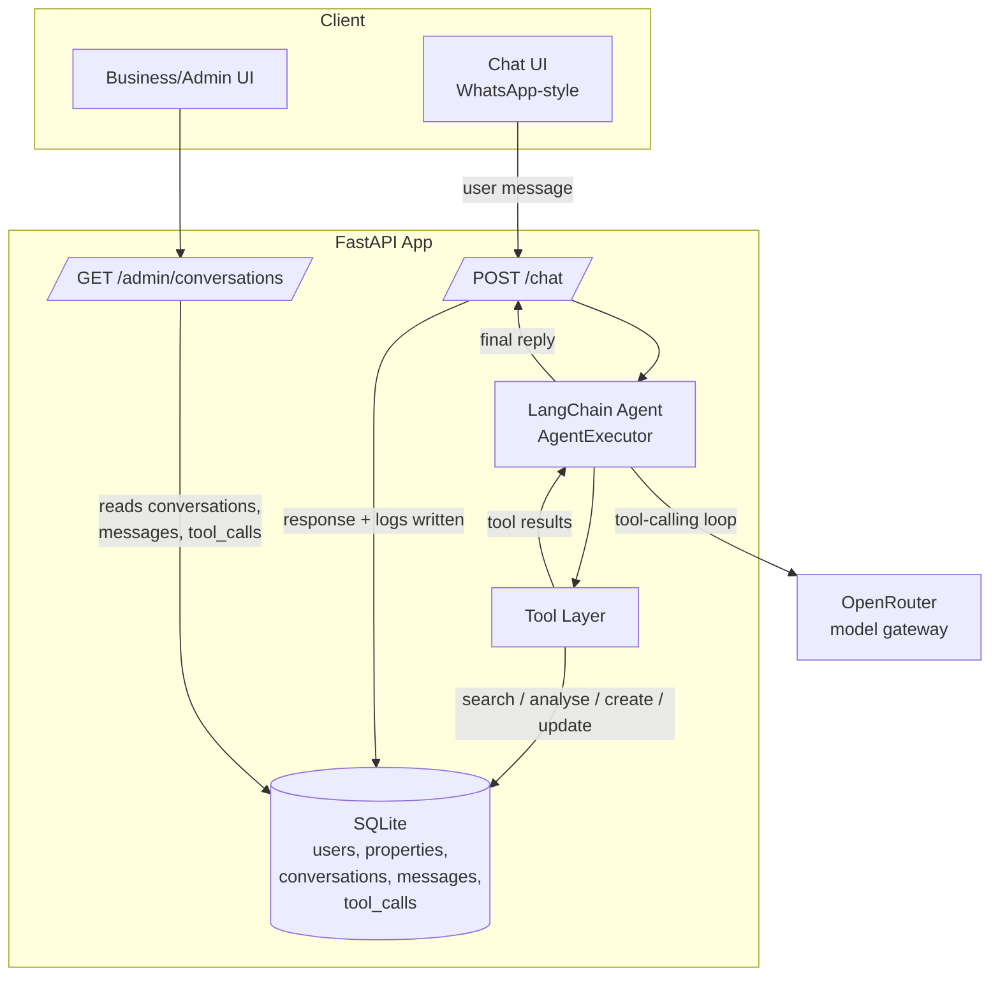

# Architecture — AI Real Estate Portfolio Analyst

## 1. Stack Choice (and why)

| Layer | Choice | Why |
|---|---|---|
| Backend | **Python + FastAPI** | Fast to stand up, async-native (matters for streaming/tool-call latency), best ecosystem overlap with LangChain and OpenRouter examples. |
| Agent framework | **LangChain (tool-calling agent, `AgentExecutor` or LangGraph `create_react_agent`)** | Satisfies the assignment's "use an agentic framework" requirement; gives structured tool-calling, easy intermediate-step logging for the business interface, and built-in conversation memory objects. |
| Model gateway | **OpenRouter** | One API for multiple model providers; lets us route cheap/fast models for simple lookups and a stronger model for multi-step reasoning without changing code. |
| Models | **`anthropic/claude-3.5-haiku`** (or `openai/gpt-4o-mini`) for the main agent loop; same model for tool-call routing — no separate routing model, see §5 | Tool-calling accuracy on structured schemas matters more than raw reasoning power here; a mid-tier fast model is enough since the "reasoning" is mostly picking the right tool and interpreting results, not open-ended thought. |
| Data store | **SQLite (via SQLAlchemy)** | Real SQL for aggregations (sums, group-bys, comparisons) instead of doing math in the LLM or in Python loops over dicts; zero-ops; trivially inspectable for the business interface and for grading. |
| Conversation state | **SQLite tables** (`conversations`, `messages`, `tool_calls`) + LangChain memory object hydrated from them per turn | Durable, and doubles as the data source for the business interface — no separate logging system needed. |
| Frontend (chat) | **Single-page HTML/CSS/JS**, WhatsApp-style bubble UI, served as a static page hitting a `/chat` REST endpoint | No build step, fastest to ship in the timebox, easy to make convincingly "WhatsApp-like" with plain CSS. |
| Frontend (business) | **Second static page** (`/admin`) hitting read-only `/admin/*` endpoints | Simple, no separate app needed. |
| Deployment | **Single FastAPI app**, deployed to Railway/Render/Fly.io | One process, one URL, minimal moving parts — appropriate for the assignment's scale. |

**Rejected alternatives:** a multi-agent setup (router + specialist agents) was considered and
rejected — the tool surface is small enough (7 tools) that one agent with a well-written system
prompt and tool docstrings performs the routing itself, and a multi-agent split would add a
network hop and latency for no accuracy gain at this scale. A vector DB / RAG approach was
rejected because the data is small, structured, and relational — SQL aggregation is both more
accurate and faster than embedding-based retrieval for "what's my total portfolio value" style
questions.

## 2. System Diagram

## 3. Request Flow (single turn)

1. User sends a message from the chat UI → `POST /chat {user_id, conversation_id, text}`.
2. Backend loads conversation history + any active hypothetical/session context from SQLite,
   hydrates it into the agent's memory.
3. Agent (LangChain `AgentExecutor`) reasons over the message, calls one or more tools via
   OpenRouter's function-calling.
4. Each tool call and its result is persisted to `tool_calls` immediately (not just at the end)
   so the business interface reflects in-progress/failed calls too.
5. Agent produces the final natural-language reply, grounded in tool outputs.
6. Reply + updated conversation state saved; response returned to the chat UI.

## 4. Data Model (SQLite)

- `users` — from `users.csv`, unchanged.
- `properties` — from `properties.csv`; `property_type` kept as-is but a `normalized_type`
  column is derived at load time (see §6) so grouping questions are consistent.
- `conversations(id, user_id, started_at, status, flagged, flag_reason)`
- `messages(id, conversation_id, role, content, created_at)`
- `tool_calls(id, conversation_id, message_id, tool_name, input_json, output_json, status,
  latency_ms, created_at)`
- `session_context(conversation_id, key, value_json)` — small key/value store for things like
  "last discussed property_ids" and "active hypothetical exclusions," so follow-ups like "how
  would that change it" resolve correctly without re-parsing the whole history every turn.

## 5. Tool Design

Seven tools (detailed in SOUL.md §5): `search_properties`, `portfolio_summary`,
`portfolio_metric`, `compare_segments`, `hypothetical_recompute`, `create_property`,
`update_property`. Each tool:
- Has a strict Pydantic input schema (so OpenRouter's function-calling has a clean target).
- Runs a parameterized SQL query or a pandas aggregation over a query result — never string-built
  SQL from LLM output, to avoid injection and keep query shape predictable.
- Returns compact, structured JSON, not prose — the LLM composes the natural-language answer,
  the tool only computes.

No separate "routing model" — the single agent's tool selection *is* the routing. A second
model would add latency for output that OpenRouter/LangChain's native tool-calling already
does in one pass.

## 6. Handling Data Quirks (per the assignment's "read the data" note)

- **Inconsistent type labels** (`Commercial Office` vs `Office`, `Retail` covering both
  high-street and mall retail): normalized at load time into `{Retail, Office, Residential}`
  for grouping questions, while the original `property_type`/`sub_type` are preserved and
  used verbatim in search results. This mapping is logged in the decision log and surfaced to
  the user if it would change the answer to a borderline question.
- **No dates anywhere**: any question implying a time series (appreciation, growth,
  "since purchase") gets an explicit "the dataset has no purchase or valuation dates, so I
  can't compute that" rather than a fabricated trend.
- **Mostly-blank `purchase_price_inr`**: treated as `NULL`/unknown, excluded from aggregates
  rather than defaulted to 0 (which would silently understate gains).

## 7. Business Interface

Read-only pages over the same SQLite tables:
- **Users & conversations list** — one row per conversation, with message count, last activity,
  and a flagged/not-flagged indicator.
- **Conversation detail** — full transcript interleaved with the tool calls made (name, input,
  output, latency, success/failure) so the business team can see exactly what the agent did and
  why.
- **Flagged view** — conversations auto-flagged for handoff (per SOUL.md §11: transactional
  intent, repeated failed resolution) surfaced first.

## 8. Latency Plan (to measure once built)

- Expect the dominant cost to be the OpenRouter round-trip(s), not the SQLite queries (which
  should be low-single-digit milliseconds on this dataset size).
- Multi-tool turns (e.g. a hypothetical recompute) cost roughly one extra model round-trip per
  tool call under a standard `AgentExecutor` loop — this is the main lever for latency at scale.
- Plan to log `latency_ms` per tool call and per full turn from turn one, so the writeup can
  cite real numbers instead of estimates.
- At higher volume: batch/cache `portfolio_summary` results per user (invalidated on
  create/update), and consider a cheaper model for simple single-tool turns vs. multi-step
  hypothetical/comparison turns.

## 9. Known Limitations (to expand in the decision log)

- Single-tenant SQLite is not a production data store at scale — fine for this assignment's
  4 users / 12 properties.
- No auth — matches the assignment's "no authenticated data source required."
- `ownership_percent` and `status` are constant in the seed data; the schema supports them but
  no logic currently branches on them.
